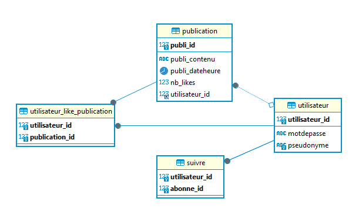
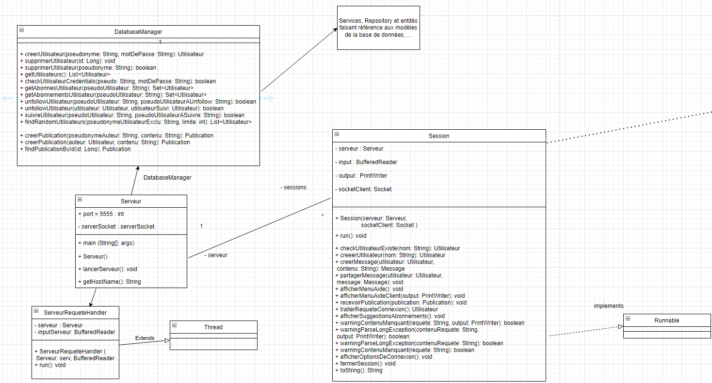
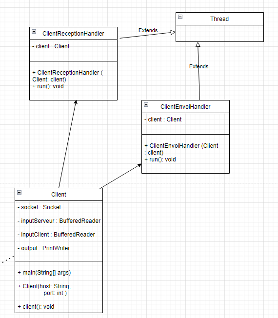

# SAE 3.03 - Système et Réseau

lien du projet Git : https://github.com/KylianRIBEROU/3.03-SAE-SYSTEMES-ET-RESEAUX

Vidéo de présentation de l'application disponible a la racine du projet.

## Rappel des attendus du projet

Le but de cette SAÉ est de développer une application client-serveur d’un réseau social : les utilisateurs peuvent publier des messages, et suivre d’autres utilisateurs pour consulter leurs publications.

Il y a deux aspects à cette application :
- le client qui doit se connecter au serveur pour afficher les messages des personnes qu’il
suit et poster ses propres publications.
- le serveur qui reçoit les messages, et les réexpédie aux bons utilisateurs.

## Membres du projet

- Kylian Riberou
- Samuel Niveau

##  Diagrammes de classes

Pour la base de données, nous avons conçu une petite base de données simple avec 4 tables ( MariaDB ) : 
- relation ManyToMany entre Utilisateur et Suivre
- relation ManyToOne entre publication et Utilisateur



Pour le serveur, voici le diagramme de classes. La classe DatabaseManager fait office de controleur frontal donc nous n'afficherons pas toutes les autres classes des couches inférieures qui représentent simplement les entités de la base de donnée.



Et enfin pour le client : 



## Travail réalisé

Nous avons répondu à toutes les demandes initiales du sujet ( poster et interagir avec des messages ). Nous avons développé une base de données pour que le serveur soit persistant. 

Nous n'avons pas développé d'interface graphique pour l'application.

## Manuel d'utilisation

### Installer et lancer l'application, côté serveur 

**Prérequis** : Avoir Maven sur son ordinateur et un SGBD

Le lancement de l'application peut être embêtant à faire et nous en sommes désolés car nous n'avons pas pris le temps de packager l'application.

Avant de lancer l'application, il faut créer la base de données qu'elle utilisera sur votre machine. 

Pour cela, renseignez dans le fichier `application.properties` les informations de connexion à votre base de données

```
C:.
└───Application
    └───reseausocial
        └───src
            └───main
                └───resources
                    └───application.properties
```

```yaml
# lien de la BD ( driver, port, nom de la BD )
# spring.datasource.url=driver://serveurBD:3306/nomBD
spring.datasource.url=jdbc:mariadb://localhost:3306/reseausocial

# pilote de la BD
spring.datasource.driver-class-name=org.mariadb.jdbc.Driver

# nom d'utilisateur de votre Base de données
spring.datasource.username=...

# mot de passe de votre Base de données
spring.datasource.password=...
```

> seulement besoin de créer la base de données, les tables seront crées par l'application

La base de données est mise en place ? Parfait.

Le projet étant fait avec Maven, vous pourrez le lancer en allant dans le répertoire reseausocial.
```txt
.
├───Application
│   └───reseausocial
```

Vous y trouverez l'exécutable `lancer_serveur.sh`.

Il lancera le projet maven et installera toutes les dépendances necéssaires au bon fonctionnement du projet. La classe principale sera ensuite lancée.

### Installer et lancer l'application, côté client

Exécuter le script `lancer_client.sh` du répertoire reseausocial.
```txt
.
├───Application
│   └───reseausocial
```


### Utiliser l'application

Que ce soit côté serveur ou client, vous pourrez effectuer la commande `/help` dans le terminal pour voir les commandes disponibles.

```txt
----------------------------------------------
Commandes serveur ( administrateur ) :
/show-all-users : affiche tous les utilisateurs
/delete <id_publication> : supprime la publication avec l'id spécifié
/remove <nomUtilisateur> : supprime l'utilisateur et ses publications
/help : affiche les commandes serveur
----------------------------------------------
```

```txt
----------------------------------------------
Liste des commandes disponibles pour le client :
/post <contenu> : poster une publication
/show-my-posts : afficher la liste des publications que vous avez postées
/show-all-posts <nom_utilisateur> : afficher la liste des publications postées par un utilisateur
/show <id_publication> : afficher une publication
/like <id_publication> : liker une publication
/delete <id_publication> : supprimer une de vos publications
/followers : afficher la liste de vos abonnés
/following : afficher la liste des utilisateurs que vous suivez
/follow <nom_utilisateur> : suivre un utilisateur
/unfollow <nom_utilisateur> : ne plus suivre un utilisateur
/help : afficher la liste des commandes disponibles
----------------------------------------------
```

## Justification des choix techniques

Pour l'application, nous avons utilisé Maven afin de structurer correctement notre projet. Cela nous permettait aussi d'installer des librairies et frameworks simplement. 

Pour la relation client-serveur, nous avons opté pour une connexion serveur-client en TCP avec multi threading classique commme celle vue en cours. Facile à mettre en place et fonctionnelle.

La classe Serveur attends une connexion d'un client, dont elle va attribuer la gestion au Thread **Session** ( voir diagramme de classes ).

Le serveur et les clients pourront recevoir et envoyer des messages en même temps.

Pour l'application en elle-même, nous avons décidé d'utiliser le framework Spring. Nous souhaitions profiter de l'occasion que nous apportait cette SAE pour découvrir de nouvelles technologies. 

Nous avons donc utilisé **Spring** avec **Spring DATA JPA** comme ORM pour communiquer avec notre base de données. JPA étant une sur-couche de JDBC, nous voulions voir ce que cette librairie apportait de plus. 

Nous avons organisé le projet de sorte à séparer le code du serveur du code de gestion de la base de données. 

```
├───client
├───Exception
├───models
│   ├───entity
│   ├───repository
│   └───service
│       └───impl
├───resources
└───server
```
Cet ORM nous permet de créer les modèles / entités directement en Java et de ne pas avoir à écrire les requêtes soi-même.

```java
// exemple de requête générée automatiquement par l'ORM ( un peu moche le nom de la méthode )
public interface UtilisateurRepository extends JpaRepository<Utilisateur, Long> {

     // get 5 utilisateurs avec plus de 10 publications et plus de 10 abonnés
     public List<Utilisateur> findTop5ByNbPublicationsGreaterThanAndNbAbonnesGreaterThan(int nbPublications, int nbAbonnes);
}
```

Nous avons aussi utilisé une petite librairie intitulée Lombok pour réduire la redondance de code.

## Conclusion

En conclusion, nous avons pu découvrir des nouvelles librairies mais cela n'a pas été très utile pour ce projet en particulier.

Nous avons pris énormément de temps à mettre en place et à utiliser ces librairies qui seraient plus adaptées à des projets de plus grande taille. ( Ici, JDBC était largement suffisant ).

Nous n'avons pas développé d'interface graphique à cause de cela et nous sommes déçus.

Enfin, le sujet de la SAE était intéressant et nous as permis de mettre en oeuvre les compétences vues durant le semestre 3 de BUT 2.

